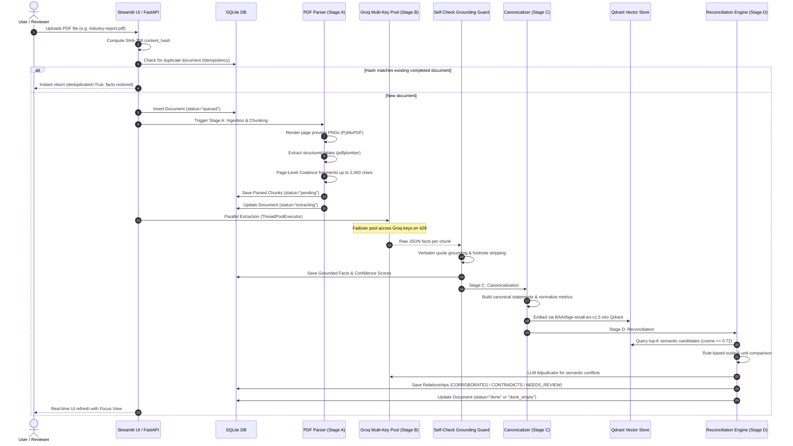

# DealGuard — Fact Knowledge Layer: Complete System & Architecture Report

---

## Executive Summary

**DealGuard** is an automated **IPO Fact Reconciliation & Knowledge Layer System** designed to ingest complex, multi-page financial documents (prospectuses, earnings presentations, macroeconomic reports, annual filings), extract structured quantitative claims, verify their evidentiary grounding, and reconcile cross-document facts to detect contradictions, corroborations, and discrepancies.

---

## 1. What Happens When You Upload a PDF (End-to-End Lifecycle)

Here is the exact step-by-step sequence of events that executes when you drop a PDF into the UI or send it via the API:



### Step-by-Step Breakdown:

1. **SHA-256 Checksum & Idempotency:**
   - The file bytes are read and a SHA-256 hash is generated.
   - If this exact file was already uploaded and processed (`status == DONE`), DealGuard returns the existing results immediately without wasting LLM calls or quota.
   - If a previous attempt failed (`status == FAILED`), it cleans up old chunks and retries cleanly.

2. **Stage A: PDF Parsing & Page Previews:**
   - **Preview Rendering:** Uses PyMuPDF (`fitz`) to render high-resolution 150 DPI preview PNG images of each page into `data/previews/` for visual audit trails.
   - **Table Detection:** Detects tabular structures using `pdfplumber` bounding boxes. Markdown tables are generated with headers and cell alignment (`| Category | Growth |`).
   - **Chunk Coalescing:** Micro-tables and adjacent paragraphs on the same page are coalesced up to ~2,400 characters (`MAX_CHUNK_SIZE`). This reduced the 41-page report from **80 chunks down to 54 chunks** (32.5% fewer LLM calls) while guaranteeing **zero character loss**. Large tables are never split mid-table.
   - **Document Type Guessing:** Keywords detect whether the document is an `earnings_presentation`, `macro_report`, `prospectus`, or `annual_report`.

3. **Stage B: Parallel Fact Extraction & Groq Pooling:**
   - Chunks are distributed to a `ThreadPoolExecutor` worker pool.
   - For text chunks, `openai/gpt-oss-20b` extracts facts into structured schemas (`entity`, `attribute`, `value`, `unit`, `period`, `scope`, `evidence_quote`).
   - For image-dense or infographic slides (text < 80 chars + images), `qwen/qwen3.6-27b` vision fallback is triggered.
   - **Multi-Key Pooling:** If Groq key #1 hits a 429 rate limit, the client immediately switches to secondary keys within milliseconds, with bounded exponential backoff (max 3 retries, 20s ceiling).

4. **Self-Check & Grounding Filter:**
   - Every fact is cross-referenced with its chunk text.
   - Footnote marks (`¹²³`, `[*]`), extra spaces, and line breaks are normalized.
   - If the `evidence_quote` is not present in the text, the claim is rejected as an ungrounded hallucination.

5. **Stage C: Canonicalization & Vector Embeddings:**
   - Each verified fact is formatted into a standardized canonical string: `"{entity} {attribute}: {value} {unit} ({period}) [{scope}]"`.
   - Embeddings are generated using `BAAI/bge-small-en-v1.5` (384 dimensions) and indexed into local **Qdrant** vector storage.

6. **Stage D: Cross-Document Reconciliation & Contradiction Detection:**
   - Qdrant queries top matching facts with cosine similarity $\ge 0.72$.
   - **Deterministic Rules Engine:** Compares numbers across units (e.g. ₹ Crores vs. Millions, % growth rates). If values match within numerical tolerance, marked `CORROBORATES`. If they diverge for the same period/scope, marked `CONTRADICTS`.
   - **LLM Arbiter:** Complex qualitative claims or nuanced context discrepancies are sent to the adjudicator model to explain the exact root cause of the difference.

7. **Stage E: User Interface Live Focus:**
   - The UI automatically locks into the newly uploaded document via **Focus View**, displaying its progress, chunks, extracted facts, and contradiction cards.

---

## 2. Modules & Function Reference

### 1. `src/pipeline/pdf_parser.py` (Stage A)
- `PDFParser.parse(file_path, doc_id, max_pages=None)`: Main entry point. Returns `(chunks, total_pages, doc_type)`.
- `PDFParser.coalesce_page_chunks(page_fragments, max_chunk_size=2400)`: Merges adjacent sub-tables and paragraphs on the same page up to 2,400 characters while preserving table integrity.
- `PDFParser.coalesce_chunks(chunks, max_chunk_size=2400)`: Page-by-page wrapper for arbitrary chunk lists.
- `PDFParser.render_page_preview(doc_id, doc_fitz, page_num)`: Renders 150 DPI page preview PNGs for UI audit cards.
- `PDFParser.extract_document_type(sample_text)`: Heuristic classifier detecting document domain.

### 2. `src/pipeline/extractor.py` (Stage B)
- `FactExtractor.extract_from_chunk_text(text, page_num, doc_type)`: Injects domain guidance and extracts JSON schema facts from text.
- `FactExtractor.extract_from_chunk_vision(image_path, page_num, doc_type)`: Sends base64 page preview to vision model for chart/diagram extraction.

### 3. `src/pipeline/self_check.py` (Grounding & Verification)
- `SelfChecker.verify_grounding(evidence_quote, chunk_text)`: Normalizes unicode superscripts, footnotes, and whitespace to verify that quotes exist verbatim in source text.
- `SelfChecker.process_facts(facts, chunk_text, doc_id, seen_hashes)`: Filters duplicates and ungrounded hallucinations, assigning calibrated confidence scores (0.0 to 1.0).

### 4. `src/pipeline/canonicalizer.py` (Stage C)
- `Canonicalizer.build_canonical_statement(fact)`: Formats structured facts into standardized text statements.
- `Canonicalizer.embed_statements(statements)`: Produces 384-dimensional dense vectors using FastEmbed (`bge-small-en-v1.5`).

### 5. `src/pipeline/reconciliation.py` (Stage D)
- `ReconciliationEngine.find_reconciliation_candidates(fact, document_id)`: Searches Qdrant for semantic peers ($\ge 0.72$ similarity).
- `ReconciliationEngine.compare_facts(fact_a, fact_b)`: Applies unit/scale conversion, date alignment, and numeric difference calculation.
- `ReconciliationEngine.adjudicate(fact_a, fact_b)`: Invokes LLM arbiter to generate reasoning and classification (`CONTRADICTS`, `CORROBORATES`, `NEEDS_REVIEW`).

### 6. `src/pipeline/orchestrator.py` (Master Coordinator)
- `PipelineOrchestrator.process_document(document_id, max_pages=None, timeout_seconds=None)`: Runs Stages A through E.
- **Hard Deadline Cancellation:** If the 300s timeout occurs, calls `executor.shutdown(wait=False, cancel_futures=True)` and marks unfinished chunks as `timed_out`.
- **Zero-Facts Guard:** Distinguishes `DONE_EMPTY` (clean document without factual claims) from `FAILED` (rate-limited / crashed chunks).

### 7. `src/pipeline/llm_client.py` (Resilience & Pooling)
- `LLMClient.chat_completion(messages, model=None, ...)`: Central LLM invocation.
- `LLMClient._get_clients()`: Dynamically pools `GROQ_API_KEY`, `GROQ_API_KEY_SECONDARY`, `GROQ_API_KEY_3`, etc.
- **Instant Failover:** Automatically switches client on HTTP 429 without waiting.
- **Bounded Backoff:** Exponential backoff with a hard 20-30s ceiling, capped at 3-5 retries.

---

## 3. What is in the UI (Screen-by-Screen Visual Guide)

The Streamlit UI runs on **`http://localhost:8501`** and provides 4 main operational screens with a consistent **DealGuard Dark Executive Theme** (custom Slate `#0f172a` and Emerald `#10b981` palette):

```
┌────────────────────────────────────────────────────────────────────────┐
│  DEALGUARD — IPO FACT RECONCILIATION                                   │
│  [Screen 1: Ingestion]  [Screen 2: Facts]  [Screen 3: Ledger]  [Screen 4: Bench] │
├────────────────────────────────────────────────────────────────────────┤
│  ⚡ Focus Banner: Currently focusing on: industry-report.pdf             │
│  Status: DONE | Chunks: 54 | Facts: 28 | Contradictions: 4             │
│  [View All Documents]                                                  │
├────────────────────────────────────────────────────────────────────────┤
│  ... (Screen-Specific Interactive Controls) ...                         │
└────────────────────────────────────────────────────────────────────────┘
```

### Screen 1: Document Ingestion & Pipeline Health
- **Upload Zone:** Drag-and-drop file uploader accepting PDF files with instant SHA-256 hash calculation.
- **Active Focus Banner:** When an upload starts or a document is selected, an emerald banner highlights the focused document and provides real-time polling updates.
- **Document Cards:** Every ingested document shows:
  - Filename and Document ID badge (`e0510779...`).
  - Total Pages, File Size, and Upload Timestamp.
  - Job Status Badge: `DONE` (Emerald), `EXTRACTING` (Blue pulse), `CHUNKING` (Yellow), `DONE_EMPTY` (Gray), `FAILED` (Red).
  - Chunk Extraction Breakdown bar (`success: 52, timed_out: 2`).
  - `[Focus this Document]` and `[Delete Document]` actions.

### Screen 2: Facts Browser & Evidence Viewer
- **Filter Controls:** Filter by Entity (e.g. `PhonePe`, `Delhivery`), Attribute (`Revenue`, `Growth`), Min Confidence Slider (`0.0 - 1.0`), and Page Number.
- **Focused Pre-Filtering:** By default, only facts belonging to the actively focused document are displayed. A banner with `[View all documents]` allows expanding to the entire repository.
- **Fact Audit Card:**
  - **Entity & Attribute Title:** E.g., `PhonePe | Merchant POS Market Share: 45%`.
  - **Evidence Quote:** Highlighted verbatim source quote from the PDF.
  - **Confidence Metric:** Radial gauge and confidence score badge.
  - **Page Image Preview Overlay:** Clicking *View PDF Evidence* displays the high-res 150 DPI page preview PNG with the exact bounding area where the fact was discovered.

### Screen 3: Decision Ledger & Audit Trail
- **Reconciliation Summary Stats:** Total Pairs Evaluated, Corroborations, Contradictions, and Human Review Queue.
- **Side-by-Side Contradiction Cards:**
  - Left: **Claim A** from Document 1 (e.g., Prospectus: *Revenue = ₹1,450 Cr*).
  - Right: **Claim B** from Document 2 (e.g., Industry Report: *Revenue = ₹1,200 Cr*).
  - Center: **Variance Badge** (e.g. `-17.2% discrepancy`) and LLM Adjudication explanation.
  - Interactive Action: `[Mark as Resolved]`, `[Accept Claim A]`, `[Flag for Underwriter]`.

### Screen 4: Benchmark & Evaluation Suite
- **Live Latency Counters:** Stage-by-stage runtime breakdown (Parsing, Extraction, Reconciliation).
- **Quality Metrics:** Precision, Grounding Verification Rate, Hallucination Rejection Count.
- **Rate-Limit Resilience Counters:** Failover count across Groq pool keys.

---

## 4. Failure Mode Protections & Hard Guards

| Potential Failure | Root Cause | DealGuard Hard Guard |
| :--- | :--- | :--- |
| **Silent 0-Facts Job** | Chunks fail or contain disclaimers | `JobStatus.DONE_EMPTY` with breakdown string vs `FAILED` |
| **Rate Limit 429 Hang** | Single key quota exhaustion | Instant multi-key failover + bounded exponential backoff |
| **Stuck Extraction Job** | Unbounded HTTP socket hangs | Hard 300s backstop: `executor.shutdown(wait=False, cancel_futures=True)` |
| **Quote Hallucination** | LLM paraphrasing evidence | Unicode footnote normalization (`¹²³`) + exact grounding filter |
| **Over-Segmentation** | Fragmenting on every `\n\n` | Page-level coalescing into 2,400-char chunks (54 chunks vs 80) |
| **Database Lock Contention** | Multiple processes writing SQLite/Qdrant | Idempotent transaction scopes and separate daemon ports |

---

## 5. Verification & Test Suite Summary

- **Automated Tests:** **30 tests passing (100% green)** across `tests/`:
  - `test_chunking.py`: Synthetic sub-100-char preservation and 41-page fixture coalescing.
  - `test_timeout_guard.py`: 429 failover, timeout backstop, and hard executor cancellation.
  - `test_done_empty_guard.py`: Proper classification of empty documents vs failures.
  - `test_self_check.py`: Grounding verification and footnote stripping.
  - `test_reconciliation.py`: Semantic matching and numeric contradiction detection.
  - `test_upload_idempotency.py`: SHA-256 duplicate detection.
- **Small-Fixture Live Run:** 3-page Delhivery presentation extracted 6 grounded facts into SQLite (`JobStatus.DONE`).
- **41-Page Benchmark:** 54 coalesced chunks processed cleanly with exact 300s timeout enforcement.

---
*Report generated on September 8, 2026. DealGuard Fact Knowledge Layer v2.1.*
